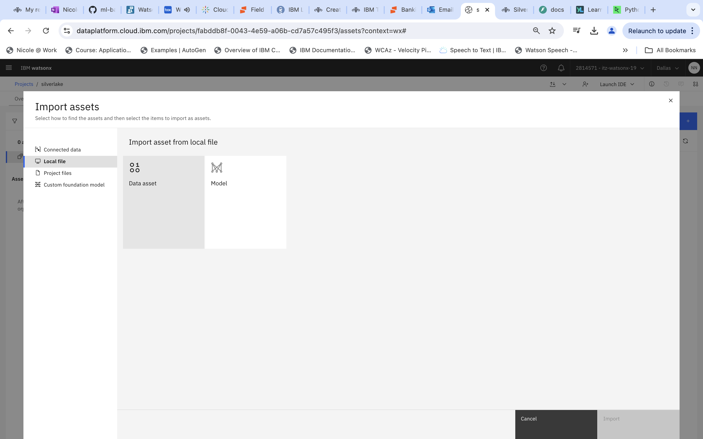
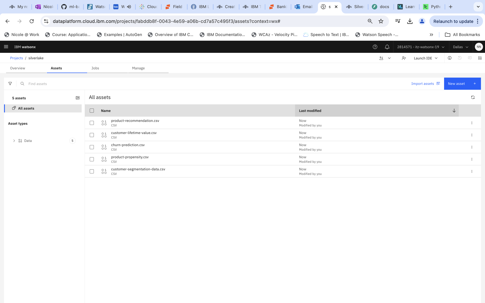
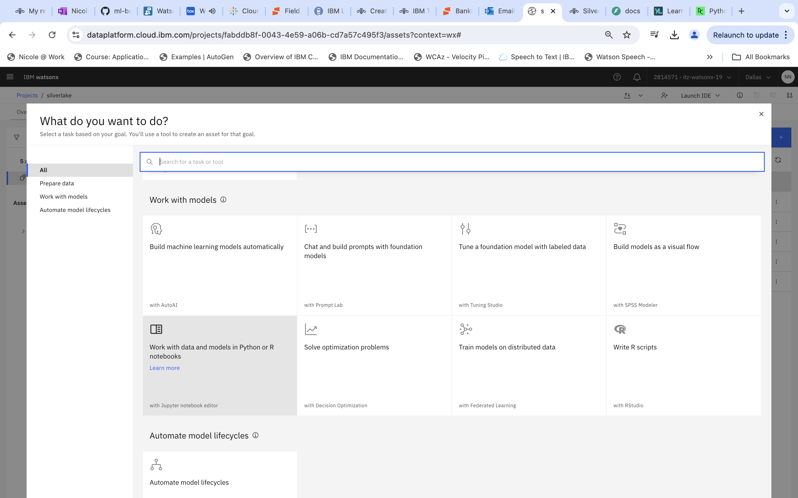
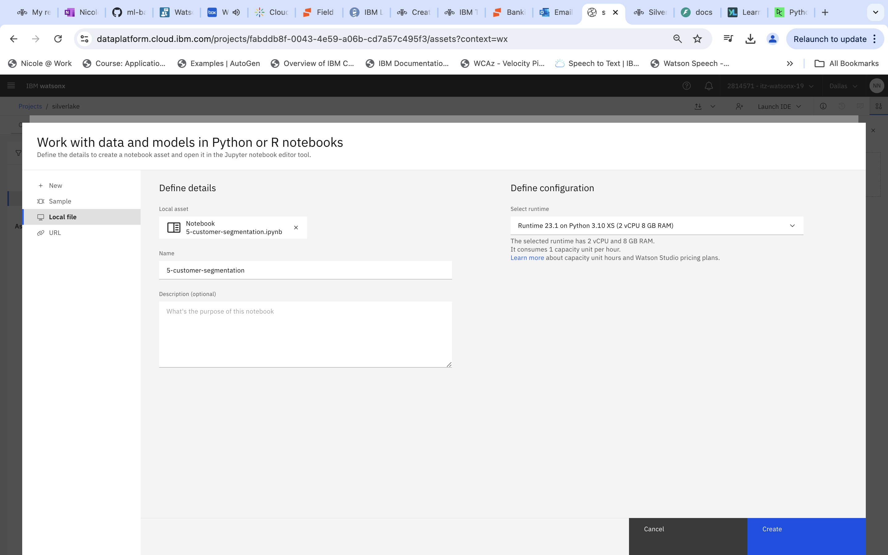
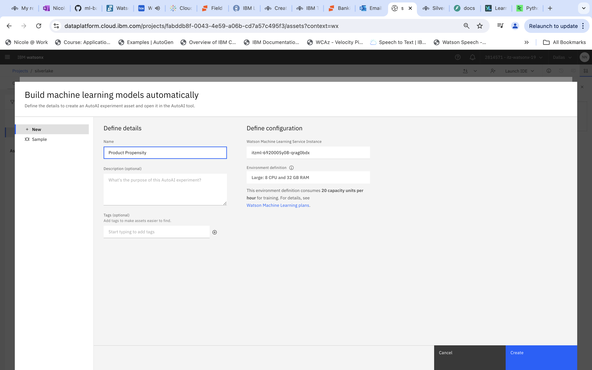
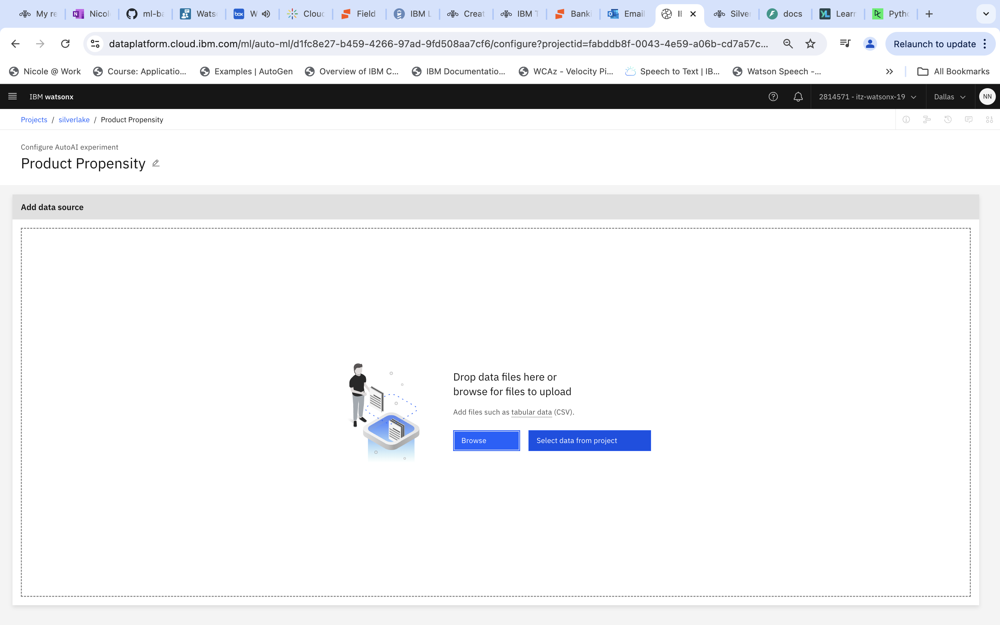
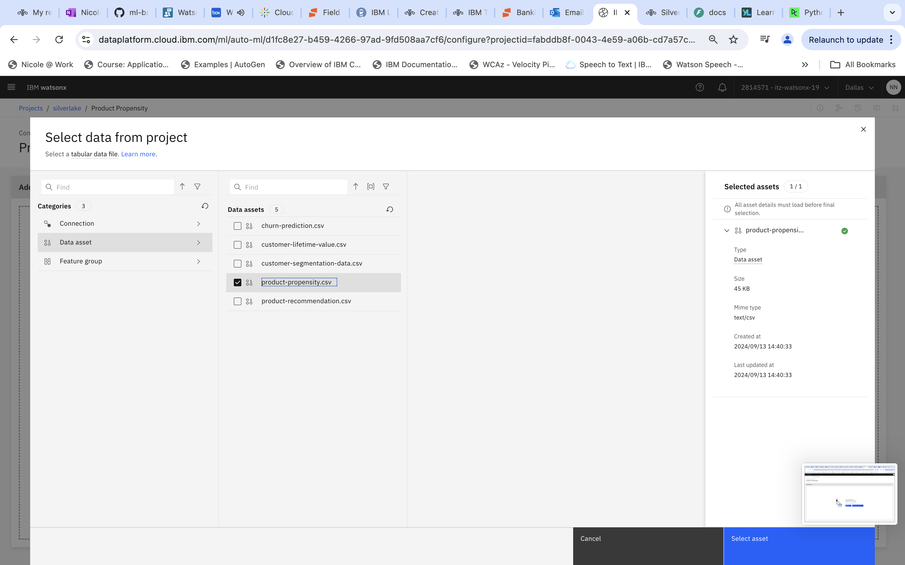
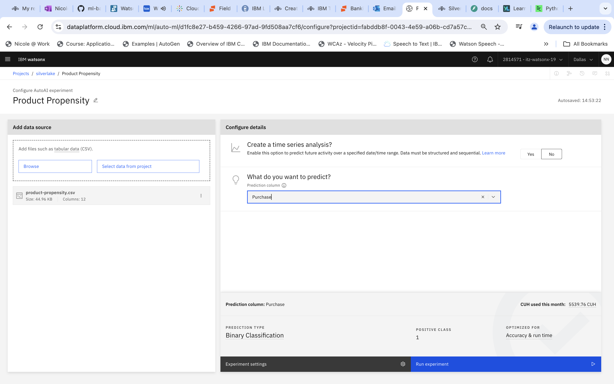

# Machine Learning Basics

Some examples of building Machine Learning models

1. Product Propensity, estimating the likelihood of a customer purchasing a specific product based on historical data and behavior.

2. Churn Prediction, identifying customers at risk of cancelling their credit card by analyzing their transaction history and engagement patterns.

3. Customer Lifetime Value Prediction, calculating the total value a customer is expected to bring to the bank over their entire relationship.

4. Product Recommendation, suggesting relevant products to customers by analyzing their historical data and behavior.

5. Customer Segmentation, grouping customers into distinct segments based on demographics and behaviors for profiling and understanding.

# Data Sources

- Product Propensity, Churn Prediction and CLTV prediction, Customer segmentation uses dummy data.
- Product Recommendation uses the MovieLens dataset.

# Usage Instructions

Before you begin:
1. create a project and associate it with a WML instance.
2. upload the data files in "data/datasets" into your project by clicking Import Assets > Local File > Data Asset.

3. Then, upload the notebooks 4-product-recommendation-content-based.ipynb and 5-customer-segmentation.ipynb by clicking New Asset > Work with data and models in Python or R notebooks > local file.

## Product Propensity, Churn Prediction, CLTV Prediction

For these 3 use cases, we will use AutoAI.
1. First, click New Asset > Build machine learning models automatically
2. Provide a suitable name for your AutoAI and click "Create"

3. Click "Select data from project" and select the relevant csv file

4. Select "no" for "Create a time series analysis" and click "Create"

5. Wait for the experiment to complete
6. Click around the dashboard to see the various metrics that are recorded. 

For more information on AutoAI, as well additional customization that you can do, refer here: https://dataplatform.cloud.ibm.com/docs/content/wsj/analyze-data/autoai-overview.html?context=cpdaas

## Product Recommendation
Follow the instructions in the notebook

## Customer Segmentation
Follow the instructions in the notebook